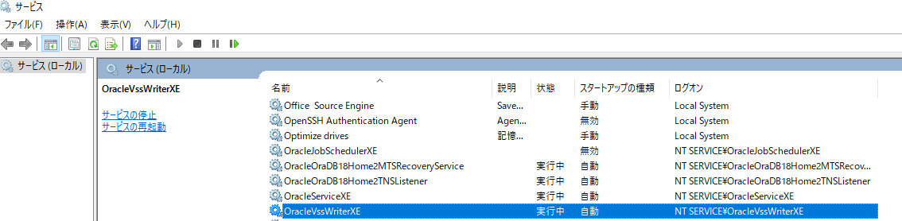
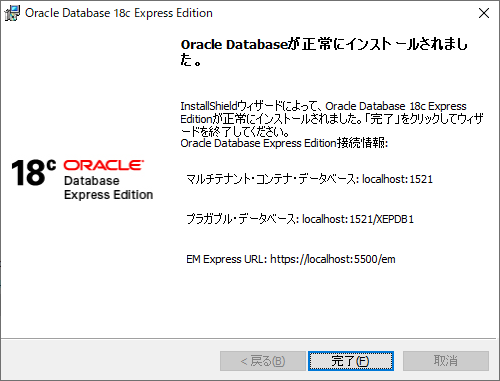

### Oracle XE がWindows10にインストールできない
Oracle 12 XEをインストール時に、既にPCにOracle 11 XEが入っているため  
インストールが途中で止まってしまうという事態が発生しました。  
その状態だと旧Oracleのアンインストールもできない！！
ということで実施した内容を以下にまとめます。   

  
### メッセージ：このマシンにはすでにoracle database express editionサービスが存在しています
Oracle 11gを前回導入していたため、ああ、11gをアンインストールすればいいのね、
と思ったのですが、以下の手順で事故ってしまいました・・・

1. 11xeを事前にアンインストールせずに12xeをインストール
1. 18xeのインストールに失敗
1. 11xeが中途半端に消えてしまいアンインストールできない！

といった困った事態になってしまったので、以下手順で解消させました。
[こちらのサイトがほぼ同じ症状となっておりました。](https://extralab.org/wp/oracle-database-18-express-edition-xe-service-uninstall/)


 ## 解消手順
1. このマシンにはすでにoracle database express editionサービスが存在しています。が表示されてインストールが先に進まない。サービスの削除を実行
1. インストールが進むようになったが、完了時に「Oracle Database 18CXEのインストールがエラーで完了しました」が表示される。レジストリの削除を実行。
1. このマシンにはすでにoracle database express editionサービスが存在しています。がまた表示されるようになったので、再度サービスの削除を実行

ここまで実行してインストールが完了しました。
順に具体的な手順を追っていきます。

※ 以前はOracle公式の削除ツールを使用して削除できていたようですが、202109現在はエクスプレスエディション用のツールを見つけれることができませんでした。

[oracle公式の削除手順](https://docs.oracle.com/cd/E16338_01/install.112/b58879/deinstall.htm#BABHIGFE)

####  サービスの削除  ####

上記イメージの名前がOracle～で始まっているサービスを全て削除する。
右クリックプロパティからサービス名のコピペが可能。
コマンドプロンプトを管理者権限で開いて
```markdown
sc delete OracleServiceXE
```
のように実行する。

####  レジストリの削除  ####
レジストリエディタを開き（ファイル名を指定して実行に「regedit」を入力して起動可）
「HKEY_LOCAL_MACHINE/SOFTWARE/ORACLE」配下を削除します。


**<font color="Red">※ 必ず削除前に右クリック→エクスポートでバックアップを取得してから、自己責任でお願いします。</font>**

以上で再度インストール処理を実行し、正常に完了するのを確認します。
